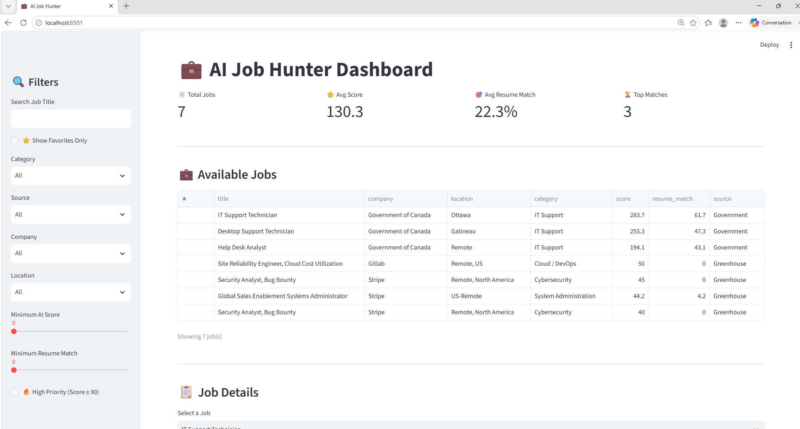
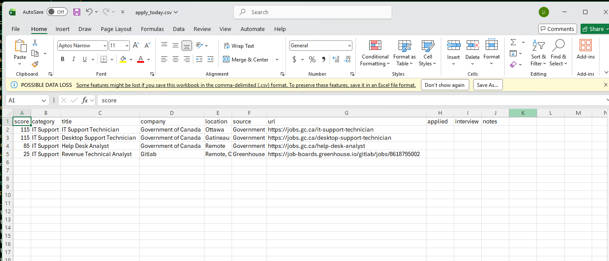

# 🤖 AI Job Hunter

> **An intelligent Python job search automation platform that collects jobs from multiple sources, filters Canadian opportunities, matches them against a resume, scores each opportunity, and generates a daily application list.**

---

## 📌 Overview

AI Job Hunter was built to automate the repetitive parts of searching for IT jobs.

Instead of manually searching multiple websites every day, the application collects job postings, removes duplicates, filters jobs by location, classifies positions, compares them against a resume, ranks them using a scoring engine, and exports a curated list of the best opportunities.

The project demonstrates practical software engineering concepts including data collection, validation, data processing, rule-based AI scoring, database management, and dashboard development.

---

# 🚀 Features

- ✅ Multi-source job collection
- ✅ Government of Canada job scraper
- ✅ Greenhouse scraper
- ✅ Lever scraper
- ✅ RemoteOK scraper
- ✅ Ashby scraper
- ✅ Adzuna scraper
- ✅ Automatic duplicate removal
- ✅ Canadian location filtering
- ✅ Job classification
- ✅ Resume skill matching
- ✅ Intelligent scoring engine
- ✅ SQLite database storage
- ✅ CSV report generation
- ✅ Daily "Apply Today" report
- ✅ Interactive Streamlit dashboard

---

# 🏗️ Architecture

```text
                 Job Sources
 ┌─────────────────────────────────────────────┐
 │ Government of Canada                        │
 │ Greenhouse                                 │
 │ Lever                                      │
 │ RemoteOK                                   │
 │ Adzuna                                     │
 │ Ashby                                      │
 └─────────────────────────────────────────────┘
                    │
                    ▼
           Collection Engine
                    │
                    ▼
          Duplicate Removal Engine
                    │
                    ▼
        Canadian Location Filter
                    │
                    ▼
          Job Classification Engine
                    │
                    ▼
          Resume Matching Engine
                    │
                    ▼
            Intelligent Scoring
                    │
                    ▼
              SQLite Database
                    │
        ┌───────────┴───────────┐
        ▼                       ▼
  CSV Reports          Streamlit Dashboard
```

---

# 📁 Project Structure

```text
AI-Job-Hunter/
│
├── app.py
├── config.py
├── dashboard.py
├── requirements.txt
├── README.md
│
├── core/
│   ├── classifier.py
│   ├── database.py
│   ├── deduplicator.py
│   ├── exporter.py
│   ├── filters.py
│   ├── job_validator.py
│   ├── location_filter.py
│   ├── logger.py
│   ├── resume_data.py
│   ├── resume_matcher.py
│   ├── rules.py
│   ├── scorer.py
│   ├── scraper_engine.py
│   └── skill_aliases.py
│
├── scrapers/
│   ├── companies/
│   ├── government.py
│   ├── greenhouse.py
│   ├── lever.py
│   ├── remoteok.py
│   ├── ashby.py
│   └── adzuna.py
│
├── dashboard/
├── data/
├── docs/
├── logs/
├── output/
├── resume/
├── sandbox/
└── screenshots/
```

---

# ⚙️ Technologies Used

### Programming

- Python 3

### Data Processing

- Pandas
- NumPy
- SQLite
- OpenPyXL

### Web Scraping

- Requests
- BeautifulSoup4
- Playwright
- lxml

### Dashboard

- Streamlit

### Other

- JSON
- CSV
- Regular Expressions

---

# 🔄 Application Workflow

1. Collect jobs from multiple sources
2. Validate job records
3. Remove duplicate postings
4. Filter Canadian opportunities
5. Classify job categories
6. Match jobs against resume skills
7. Calculate intelligent job scores
8. Save qualified jobs into SQLite
9. Export CSV reports
10. Display results in the Streamlit dashboard

---

# 📊 Reports Generated

```text
output/

all_jobs.csv

canadian_jobs.csv

apply_today_YYYYMMDD_HHMMSS.csv
```

---

# 🖥️ Example Output

```text
Jobs Collected       : 2541
Canadian Jobs        : 424
Jobs Classified      : 424
Resume Matched Jobs  : 424
Jobs Scored          : 424
Top Matches          : 6
```

---

# 📈 Scoring Engine

Jobs are ranked using multiple weighted factors including:

- Job category
- Job title
- Required technical skills
- Preferred companies
- Job location
- Resume compatibility score

This allows the application to prioritize opportunities that best match the candidate's experience.

---

# 🚀 Installation

Clone the repository

```bash
git clone https://github.com/1221pentest-hash/AI-Job-Hunter.git
```

Navigate to the project

```bash
cd AI-Job-Hunter
```

Install dependencies

```bash
pip install -r requirements.txt
```

Run the application

```bash
python app.py
```

Launch the dashboard

```bash
streamlit run dashboard.py
```

---

# 📸 Screenshots

## Streamlit Dashboard



---

## Daily Apply Report



---

## Multi-Source Job Collection


---

## Successful Application Run


---

## CSV Export


# 🛣️ Roadmap

### Version 1.2

- ✅ Multi-source scraping
- ✅ Resume matching
- ✅ Intelligent scoring
- ✅ SQLite database
- ✅ CSV exports
- ✅ Streamlit dashboard

### Future Versions

- Live Government of Canada integration
- LinkedIn integration
- AI-generated cover letters
- Resume optimization
- Email notifications
- Telegram notifications
- Google Sheets integration
- Machine learning ranking
- Docker deployment
- REST API
- Cloud deployment

---

# 🤝 Contributing

Contributions, ideas, and suggestions are welcome.

Feel free to fork the repository and submit a pull request.

---

# 👨‍💻 Author

**Israel Loyo**

IT Support • Systems Administration • Cybersecurity • Python Automation

GitHub

https://github.com/1221pentest-hash

LinkedIn

https://linkedin.com/in/israel-loyo

---

# 📄 License

This project is licensed under the MIT License.

---

## ⭐ If you found this project useful, consider giving it a star!