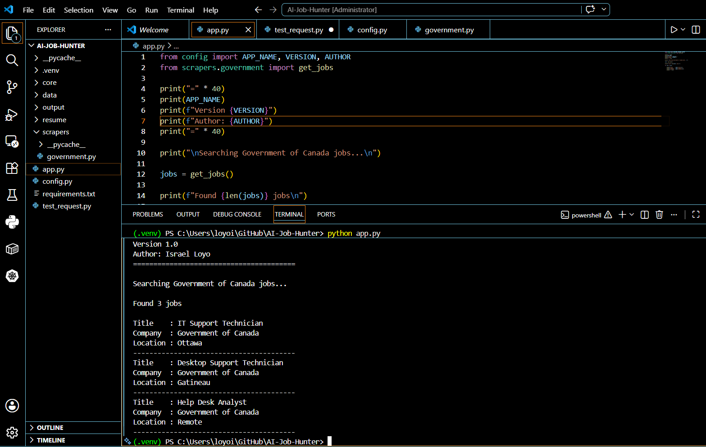
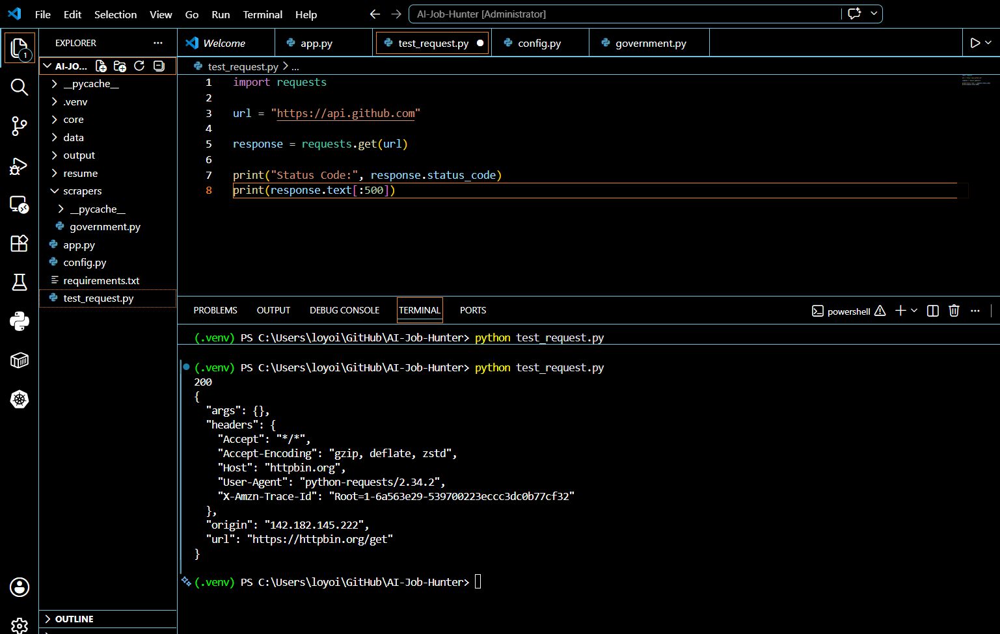
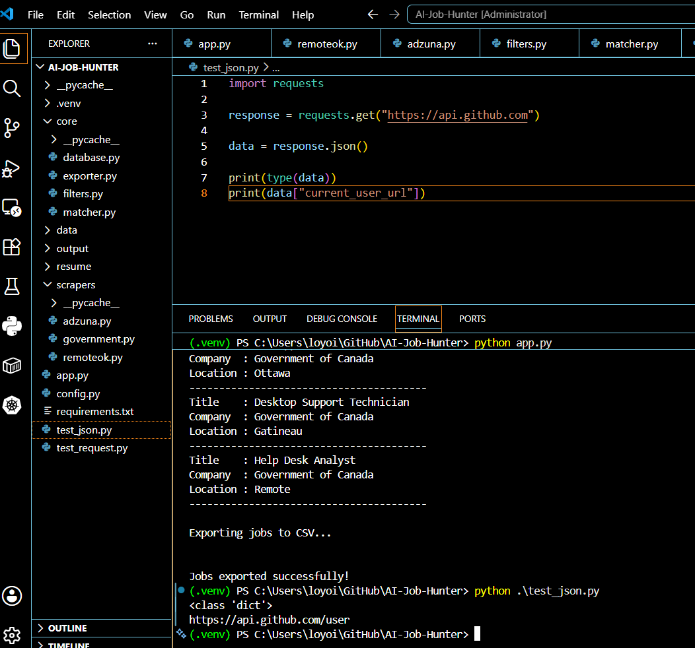
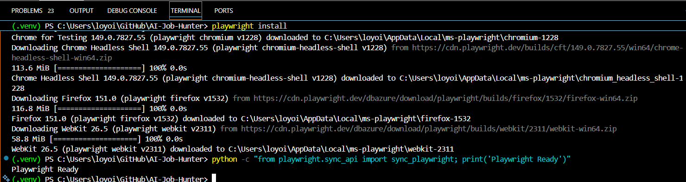
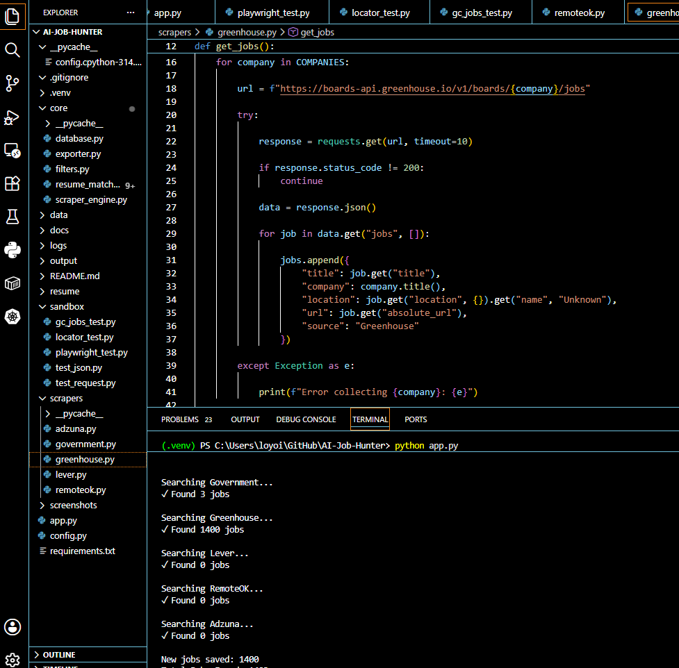
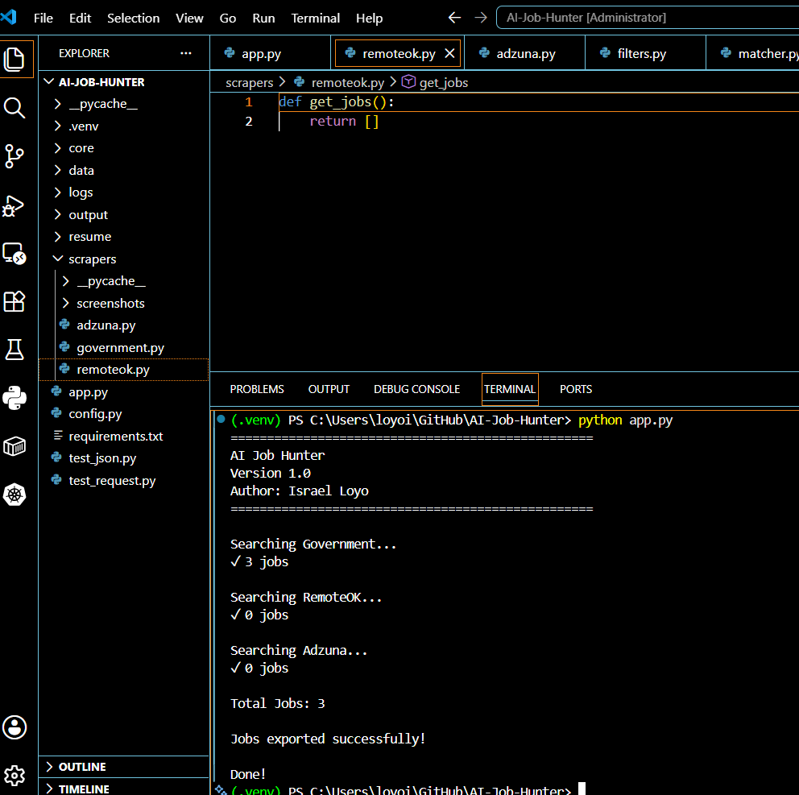
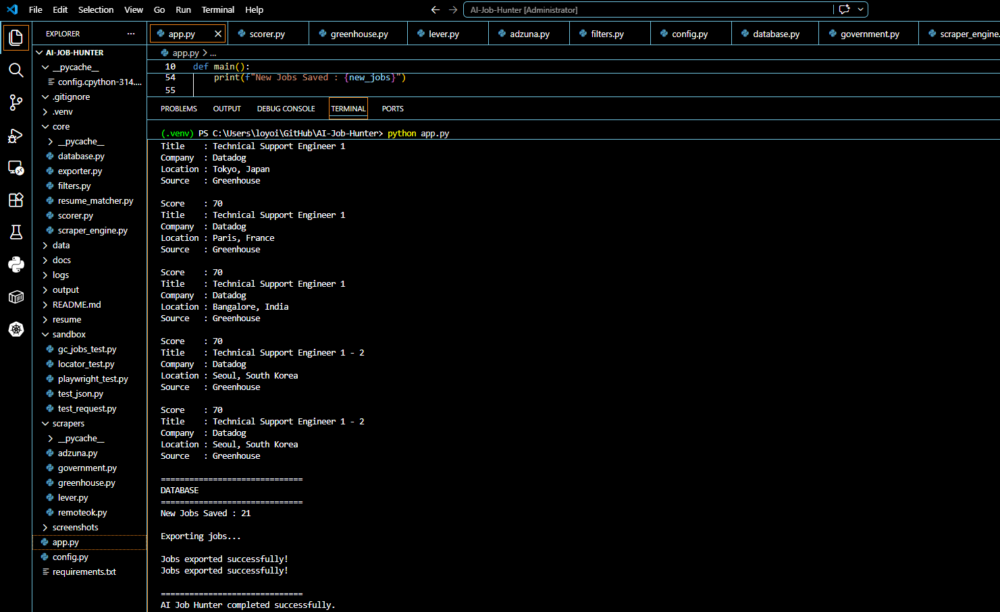
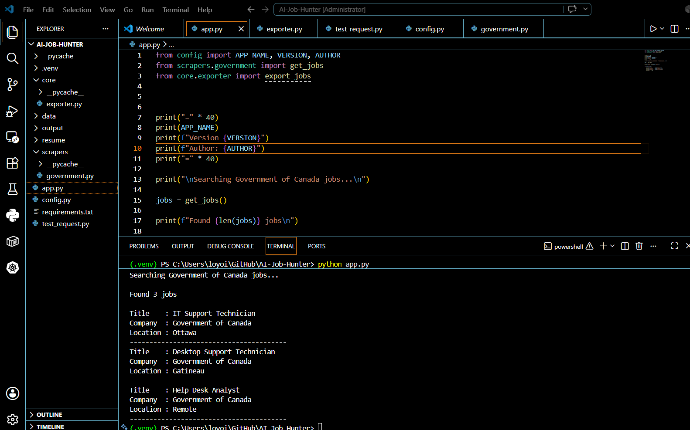
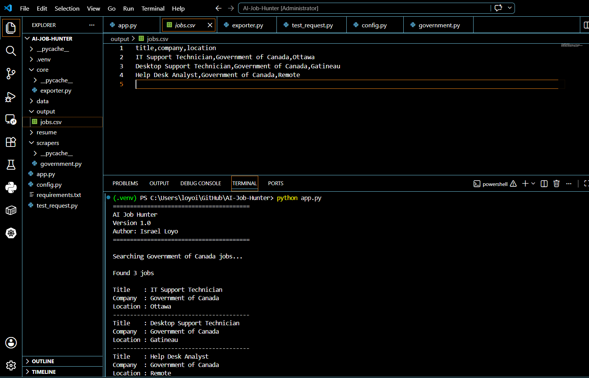

# 🤖 AI Job Hunter

An AI-powered Python application that automatically collects, filters, scores, and exports IT job opportunities from multiple online sources.

## Overview

AI Job Hunter helps IT professionals automate their job search by gathering job listings, filtering them by location, ranking them based on relevance, and exporting the best opportunities for quick application.

Instead of manually browsing job boards every day, AI Job Hunter performs the repetitive work automatically.

---

## Features

- Collect jobs from multiple sources
- Filter jobs by Canadian locations
- Intelligent relevance scoring
- SQLite database storage
- CSV exports
- Timestamped daily reports
- Modular scraper architecture

---

## Architecture

```
Collect Jobs
      │
      ▼
Export all_jobs.csv
      │
      ▼
Location Filter
      │
      ▼
Export canadian_jobs.csv
      │
      ▼
AI Relevance Engine
      │
      ▼
SQLite Database
      │
      ▼
Export apply_today_TIMESTAMP.csv
```

---

## Technologies

- Python 3
- SQLite
- Requests
- CSV
- Git
- GitHub

---

## Project Structure

```
AI-Job-Hunter/
│
├── app.py
├── config.py
├── requirements.txt
├── core/
├── scrapers/
├── output/
├── docs/
└── README.md
```

---

## Installation

```bash
git clone https://github.com/1221pentest-hash/AI-Job-Hunter.git

cd AI-Job-Hunter

pip install -r requirements.txt

python app.py
```

---

## Example Output

```
Collected Jobs: 2572

Canadian Jobs: 435

Top Matches: 18

Database Updated

MISSION COMPLETE
```

---

## Roadmap

- Improve relevance engine
- Google Sheets integration
- Telegram notifications
- Resume-to-job matching
- AI-generated cover letters

---

## Screenshots

### Project Structure



---

### HTTP Connectivity Test

Verifying external API communication using Python Requests.



---

### JSON API Parsing

Testing JSON responses before integrating live job APIs.



---

### Playwright Installation

Browser automation environment configured successfully.



---

### Greenhouse Live Scraper

Collecting live job postings from Greenhouse company boards.



---

### Multi-Source Job Collection

Collecting jobs from multiple providers in a single execution.



---

### Successful Application Run

Complete execution of the AI Job Hunter pipeline.



---

### CSV Export

Exporting collected jobs into CSV format.



---

### Generated Output

Example of the generated job report.



## Author

**Israel Loyo**

IT Support • Systems Administration • Python Automation • Cybersecurity

LinkedIn:
https://linkedin.com/in/israel-loyo

GitHub:
https://github.com/1221pentest-hash